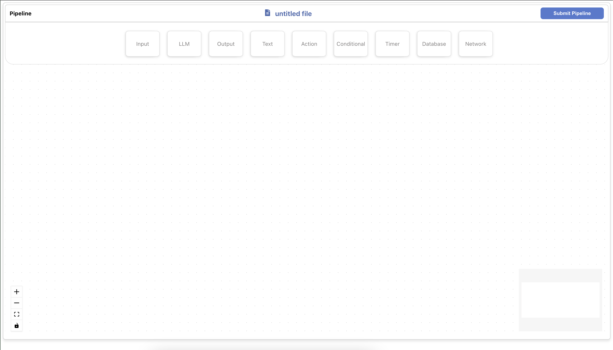
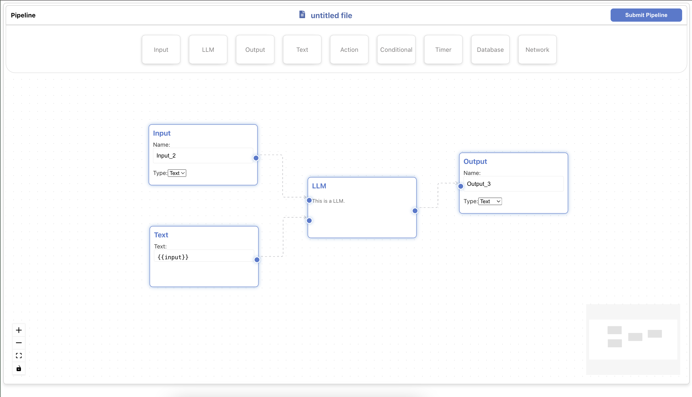

# Flowcraft

## 📌 Project Overview

This is a React-based frontend project built using `npm` and `react-scripts`. The project includes interactive components and utilizes `reactflow` for flow-based diagrams.

## 🏗️ Project Architecture

```
frontend/
├── archive/                # Archive files
├── public/                 # Static assets (images, icons, etc.)
├── src/
│   ├── components/         # Reusable components
│   │   ├── componentFolder/  # Draggable node component
│   │   │   ├── component.js
│   ├── store/              # Global state management
│   │   ├── store.js
│   ├── App.js              # Main app component
│   ├── App.css             # Stylesheet for App
│   ├── index.js            # Entry point of the app
│   ├── index.css           # Global styles
├── package.json            # Project dependencies and scripts
├── README.md               # Project documentation
```

## 📸 Screenshots

### Home Page



### Flow Diagram Example



## ⚙️ Installation and Setup

To run this project locally, follow these steps:

1. Clone the repository:

   ```sh
   git clone <repository-url>
   cd frontend
   ```

2. Install dependencies:

   ```sh
   npm install
   ```

3. Start the development server:

   ```sh
   npm start
   ```

   The app will be available at `http://localhost:3000/`.

4. To build the project for production:
   ```sh
   npm run build
   ```

## 📦 Dependencies

The project uses the following npm packages:

- `react` - Core React library
- `react-dom` - React's virtual DOM
- `react-scripts` - Scripts for managing the build process
- `react-icons` - Icons library for React
- `reactflow` - Library for flow-based diagrams
- `@testing-library/react` - Testing utilities
- `@testing-library/jest-dom` - Jest matchers for testing
- `@testing-library/user-event` - User event simulation
- `web-vitals` - Web performance metrics

## 🚀 Features

- Interactive flow-based components using `reactflow`
- Modular and scalable architecture
- State management using a centralized store
- Fully responsive UI

## 🛠️ Development Tools

- Node.js & npm
- React Developer Tools
- VS Code / Any preferred IDE

## 📝 License

This project is open-source and available under the [MIT License](LICENSE).

---

Feel free to contribute, report issues, or suggest improvements!

Happy coding! 🚀
